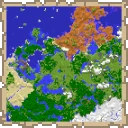

# Palette

[](https://github.com/plonck/palette/releases/latest)
[](LICENSE)

Palette is a tiny Fabric utility mod designed to programmatically extract **internal map color data** from **Minecraft Java Edition**. It generates headerless CSV tables mapping block identifiers to map colors, and map color IDs to their specific RGB values.

This tool is useful for map tool developers, pixel artists, and data enthusiasts who need accurate, version-specific color data directly from the game's code. For further information on map colors, please refer to the dedicated [Minecraft Wiki page](https://minecraft.wiki/w/Map_item_format).



## Output

### `colors.csv`

This file contains the RGB values for every valid map color ID. It accounts for the four distinct shading variants (brightness levels) that Minecraft applies to base map colors.

**Format:** `COLOR_ID,R,G,B`

- `COLOR_ID`: Calculated as `4 * COLOR_BASE_ID + COLOR_SHADE_ID`
- `R`, `G`, `B`: Standard 0-255 integer values of the red, green, and blue components

**Example:**

```
4,89,125,39
5,109,153,48
6,127,178,56
7,67,94,29
...
```

> **Note:** Color ID `0` (transparent) is excluded from the table.

### `blocks.csv`

This file maps every registered Minecraft block to its base map color ID.

**Format:** `BLOCK_ID,COLOR_BASE_ID`

- `BLOCK_ID:` Namespaced resource location of the block (e.g., `minecraft:grass_block`).
- `COLOR_BASE_ID:` Integer ID of the base map color associated with the block's default state.

**Example:**

```
minecraft:air,0
minecraft:stone,11
minecraft:granite,10
minecraft:grass_block,1
minecraft:diorite,14
...
```

## Usage

### Option A: Download Data

You do not need to compile the code to get the data.

1. Go to the [Releases](https://github.com/plonck/palette/releases) page.
2. Select the version matching your target Minecraft version.
3. Expand the **Assets** dropdown.
4. Download `colors.csv` and `blocks.csv`.

### Option B: Build Locally

If you wish to export the data locally (e.g., for a snapshot version), run the build script matching your operation system:

```sh
# Linux or macOS
./build.sh

# Windows
.\build.bat
```

Upon success, the output files will be located under `./build/palette/`.

### Option C: Build in a Container

If you have a container runtime (like Docker or Podman) installed, you can execute the entire build flow in an isolated environment using the Makefile:

```sh
make build
```

The resulting data files will be copied to your host machine under `./build/palette/`.

## Python Example

Here is how you might load this data in Python:

```py
import csv

# Load colors: { color_id: (r, g, b) }
colors = {}
with open('colors.csv', 'r') as f:
    for row in csv.reader(f):
        colors[int(row[0])] = (int(row[1]), int(row[2]), int(row[3]))

# Load blocks: { block_id: base_color_id }
blocks = {}
with open('blocks.csv', 'r') as f:
    for row in csv.reader(f):
        blocks[row[0]] = int(row[1])
```

Once loaded, you can perform a lookup to find the RGB color associated with a specific block ID by first finding its base color ID and then querying the `colors` dictionary:

```py
block_id = 'minecraft:stone'
color_id = 4 * blocks.get(block_id) + 0
r, g, b = colors.get(color_id)

print(f"The default color for {block_id} is ({r}, {g}, {b})")
```

## Gradle Integration

If you are developing a Java or Kotlin application, you can automate the data retrieval process directly within your build script.

The following **Kotlin DSL** snippet registers a custom Gradle task that fetches specific versions of `colors.csv` and `blocks.csv` from GitHub Releases. It automatically adds these files to your project's resources source set, ensuring the data is bundled with your application when it is compiled.

```kts
import org.gradle.api.DefaultTask

tasks.register<DefaultTask>("downloadPalette") {
  description = "Fetches block color tables from GitHub"
  group = "resource"
 
  // NOTE: This assumes 'minecraft' version is declared in gradle/libs.versions.toml
  val minecraftVersion = libs.versions.minecraft.get()
  inputs.property("release", minecraftVersion)

  val outputDir = layout.buildDirectory.dir("generated/resources/palette")
  outputs.dir(outputDir)

  val releaseUrl = "https://github.com/plonck/palette/releases/download/$minecraftVersion"
  val assetNames = listOf("colors.csv", "blocks.csv")

  doLast {
    val dir = outputDir.get().asFile
    dir.deleteRecursively()
    dir.mkdirs()

    assetNames.forEach { assetName ->
      val sourceUrl = "$releaseUrl/$assetName"
      val assetFile = dir.resolve(assetName)

      logger.lifecycle("Downloading $sourceUrl to ${assetFile.absolutePath}")

      ant.withGroovyBuilder {
        "get"(
          "src" to sourceUrl,
          "dest" to assetFile,
          "skipexisting" to "false",
          "verbose" to "true"
        )
      }
    }
  }
}

sourceSets {
  main {
    resources.srcDir(tasks.named("downloadPalette"))
  }
}
```

## License

This project's source code is distributed under the **MIT License**. Under the terms of this license, you are granted the freedom to use, copy, modify, and share this software and any resulting output artifacts.

For full details, please view the [LICENSE](LICENSE) file.
